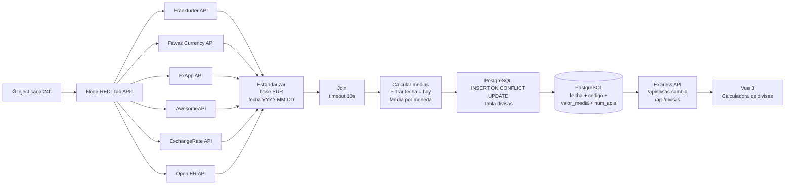

# Calculadora de divisas

Calculadora de divisas para convertir entre diferentes monedas utilizando tasas de cambio actualizadas, los datos provienen de diferentes APIs de divisas.

## Requisitos previos
- Node.js
- npm 
- Docker

## Características
- Conversión de divisas actualizadas cada día.
- Historial de conversiones para revisar las transacciones anteriores.
- Interfaz de usuario sencilla e intuitiva.
- Soporte para múltiples monedas y criptomonedas.

## Tecnologías utilizadas
- **Frontend**: Vue.js, HTML, CSS
- **Backend**: Node.js, Node-RED, PostgreSQL, Express
- **APIs de divisas**: 
  - [ExchangeRate-API](https://www.exchangerate-api.com/)
  - [Open Exchange Rates](https://openexchangerates.org/)
  - [Frankfurter API](https://www.frankfurter.app/)
  - [Currency API de fawazahmed](https://fawazahmed0.github.io/currency-api/)
  - [Fxapp API](https://fxapp.net/)
  - [AWESOME API](https://awesomeapi.com.br/api-de-moedas)

## Instalación y uso
1. Clona el repositorio:
```bash
git clone https://github.com/Santiagofamo18/calc-divisas.git
```
2. Navega al directorio del proyecto:
```bash
cd calc-divisas
```
3. Instala las dependencias:
```bash
npm install
```
4. Levantar el servidor de backend en Node-red usando Docker Compose:
```bash
docker-compose up -d --build
```
5. Copiar el archivo `.env.example` a `.env` y ajustar las variables de entorno con la configuración de tu base de datos PostgreSQL y las APIs de divisas que deseas utilizar.

6. Inicia el servidor de desarrollo:
```bash
npm run dev
```
7. Abre tu navegador y accede a `http://localhost:5173` para utilizar la calculadora de divisas.

La calculadora ira almacenando el historial de conversiones realizadas, para poder revisar las transacciones anteriores en un futuro. 

## Explicación del flujo de Node-RED

